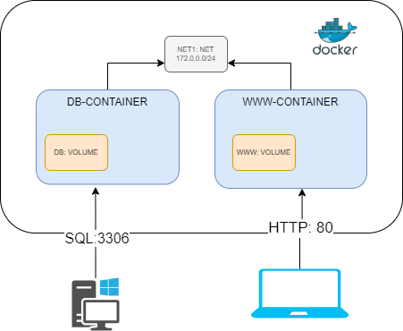

# Manual Implantación página personal

En este manual vamos a poder instalar y mantener la implantación de la infraestructura de nuestra página web personal desarrollada en tecnología PHP+MYSQL.

Para poder implanatarla utilizaremos Docker.


## Requisitos Previos

Tendremos que tener instalado Docker y Docker-Compose.

Este manual esta preparado para una instalación utilizando [Docker-Desktop](https://www.docker.com/products/docker-desktop/) en Windows, version 4.36.0, pero podría ser perfectamente valido para cualquier tipo de instalación docker.

Si por ejemplo necesitamos una cuenta de AWS, o cualquier conocimiento previo necesario.

Aquí también pueden entrar referencias a manuales anteriores.

## Arquitectura de la implementación

Aquí pondremos un diagrama de componentes HW y sus relaciones o comunicaciones.



Aquí explicaré los diferentes componentes del diagrama.

### DB-Container

Es un contenedor para tener una BBDD donde colocaremos nuestra lista de proyectos

### Net 1

Aquí especificamos la red, de que tipo. ETC.

### Componente X

## SW instalado

En nuestra Infraestructura seguro que metemos SW. 

Explicaremos de donde procede y como se debe de instalar en la infraestructura.
También a su vez a lo mejor hay que configurarlo para que funcione en nuestra infraestructura.

Por ejemplo la página WEB personal hay que cambiar el fichero index.php donde indicaremos la IP de nuestro servidor de BBDD, el puerto el usuario y el Password.

## Puesta en marcha

Aquí indicaremos los comandos de puesta en marcha.

Para montar las imagenes
```bash
docker-compose build
```

Para arrancar los contenedores
```bash
docker-compose up -d
```
### Instalación de Contenedor DB

Aquí podriamos explicar en más detalle la información de ese contenedor, o hacer referencia al fichero DockerFile.

También podremos meter pantallazos de las instrucciones de puesta en marcha.

```Dockerfile
# Usa una imagen base
FROM python:3.9-slim

# Establece el directorio de trabajo
WORKDIR /app

# Copia los archivos necesarios
COPY requirements.txt .

# Instala las dependencias
RUN pip install -r requirements.txt

# Copia el resto del código
COPY . .

# Define el comando de inicio
CMD ["python", "app.py"]
```
### Instalación de Contenedor WWW

Aquí podriamos explicar en más detalle la información de ese contenedor, o hacer referencia al fichero DockerFile

También podremos meter pantallazos de las instrucciones de puesta en marcha.

## Mantenimiento de Infraestructura

Aquí podemos tratar aspectos del mantenimiento de la Infraestructura. Por ejemplo explicar el sistema de copias de seguridad.

También aquí podemos poner una lista de comandos más usados.

Para parar los contenedores
```bash
docker-compose stop
```

Para arrancar de nuevo los contenedores
```bash
docker-compose start
```

Para acceder a la máquina BBDD
```bash
docker exec -ti aaaaaa /bin/bash
```

Para acceder a la máquina WWW
```bash
docker exec -ti wwwwwww /bin/bash
```

etc.

## Puntos de entrada al sistema

Si los gestores de la página WEB quieren acceder a la BBDD lo podrán realizar usando un cliente SQL conectado a:

- Host: XXXX
- Puerto: XXXX
- Nombre de BBDD: XXXX

Si los gestores de la página WEB quieren cambiar el código la pagina web deberán:

- Paso 1
- Paso 2
- Paso 3

## TroubleShooting

Aquí especificamos los principlaes problemas que nos hemos encontrado y cual ha sido la resolución.